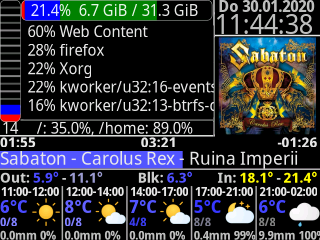

  Clear 19
============================

  About
-------

Use the LCD of a Logitech G19 on Linux.

Based on __Logitech G19 Linux__ with a lot of improvements:
* Use Python 3.8.
* Use Cairo instead of Pillow for high quality rendering.
* Render directly to LCD format. No expensive conversion is required.
* Use Pango for font rendering.
* Replace applets architecture by a screens and widgets framework.

   Features
--------------

* Supports multiple screens which can be changed with the direction keys, but currently, only the 
  main screen is implemented.
* Show CPU and memory usage.
* List tasks with highest CPU use.
* Show disk usage.
* Show current date and time.
* Show current track of media player.
* Show weather forecast from wetter.com.

  Requirements
--------------

* Python 3.8
* pyusb
* cairocffi
* pangocffi
* pangocairocffi
* CairoSVG
* psutil
* beautifulsoup4

   How to modify
---------------
Look at the file clear19/App/main_screen.py. Try to modify add ao remove some widgets.
